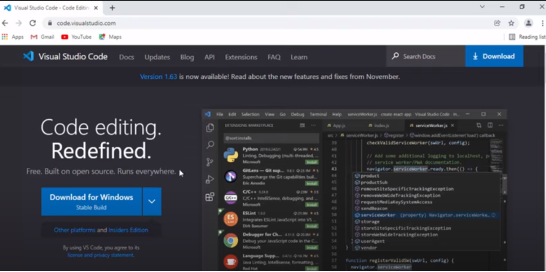
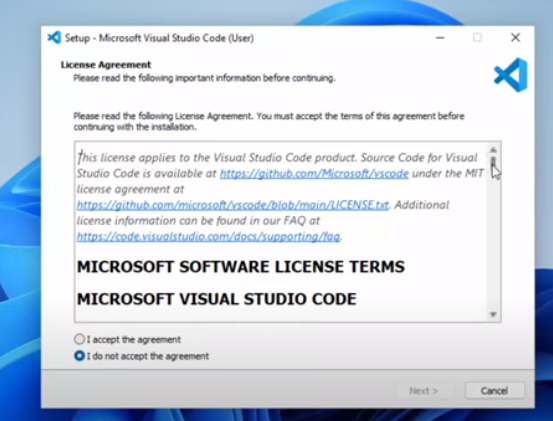
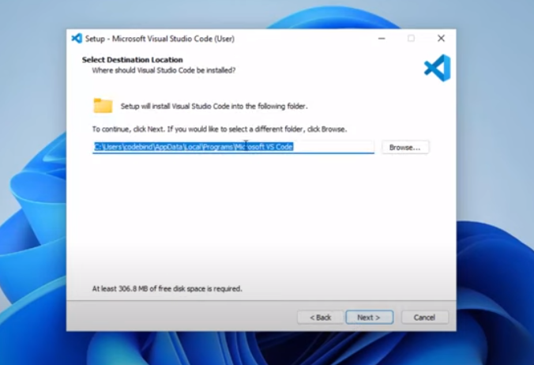
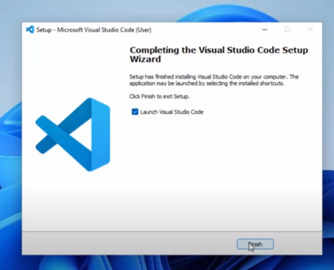
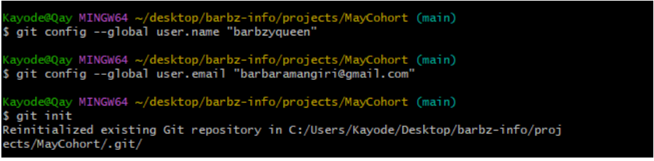
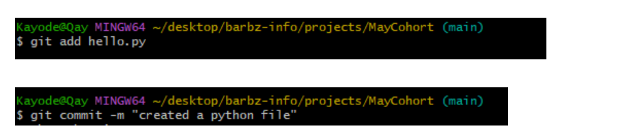

# Dev_Setup
Setup Development Environment

#Assignment: Setting Up Your Developer Environment

#Objective:
This assignment aims to familiarize you with the tools and configurations necessary to set up an efficient developer environment for software engineering projects. Completing this assignment will give you the skills required to set up a robust and productive workspace conducive to coding, debugging, version control, and collaboration.

#Tasks:

1. Select Your Operating System (OS):
   Choose an operating system that best suits your preferences and project requirements. Download and Install Windows 11. https://www.microsoft.com/software-download/windows11

2. Install a Text Editor or Integrated Development Environment (IDE):
   Select and install a text editor or IDE suitable for your programming languages and workflow. Download and Install Visual Studio Code. https://code.visualstudio.com/Download
3. Set Up Version Control System:
   Install Git and configure it on your local machine. Create a GitHub account for hosting your repositories. Initialize a Git repository for your project and make your first commit. https://github.com

4. Install Necessary Programming Languages and Runtimes:
  Instal Python from http://wwww.python.org programming language required for your project and install their respective compilers, interpreters, or runtimes. Ensure you have the necessary tools to build and execute your code.

5. Install Package Managers:
   If applicable, install package managers like pip (Python).

6. Configure a Database (MySQL):
   Download and install MySQL database. https://dev.mysql.com/downloads/windows/installer/5.7.html

7. Set Up Development Environments and Virtualization (Optional):
   Consider using virtualization tools like Docker or virtual machines to isolate project dependencies and ensure consistent environments across different machines.

8. Explore Extensions and Plugins:
   Explore available extensions, plugins, and add-ons for your chosen text editor or IDE to enhance functionality, such as syntax highlighting, linting, code formatting, and version control integration.

9. Document Your Setup:
    Create a comprehensive document outlining the steps you've taken to set up your developer environment. Include any configurations, customizations, or troubleshooting steps encountered during the process. 

#Deliverables:
- Document detailing the setup process with step-by-step instructions and screenshots where necessary.
- A GitHub repository containing a sample project initialized with Git and any necessary configuration files (e.g., .gitignore).
- A reflection on the challenges faced during setup and strategies employed to overcome them.

#Submission:
Submit your document and GitHub repository link through the designated platform or email to the instructor by the specified deadline.

#Evaluation Criteria:**
- Completeness and accuracy of setup documentation.
- Effectiveness of version control implementation.
- Appropriateness of tools selected for the project requirements.
- Clarity of reflection on challenges and solutions encountered.
- Adherence to submission guidelines and deadlines.

Note: Feel free to reach out for clarification or assistance with any aspect of the assignment.

ANSWER:

DOWNLOADING GIT:
I searched for Git on my browser:
   - I went to Git’s official website: https://git-scm.com/
   - I clicked on the "Download" button and it provided the appropriate download link for my windows operating system

Installing Git on Windows
   - I located the downloaded .exe file and double-clicked to run the installer.
   - I followed the setup wizard prompts. Click Next on the initial screen.
   - I chose the default installation location and clicked Next.
   - I ensured that "Git Bash Here" and "Git GUI Here" were selected for easier command-line access. Then clicked Next.
   After completing the installation, I ensured Git was installed correctly by running git --version in the terminal.

I found the process of downloading Git easy and did not encounter any difficulties.

VISUAL STUDIO CODE INSTALLATION:
This is the step-by-step process on how I downloaded and installed Visual Studio Code 

   - I opened my web browser and searched for Visual Studio Code on the official website: https://code.visualstudio.com/download
   - I chose the installation for 64 bit because my system is 64bit.
   

Running the Visual Studio Code  Installer:

   - I downloaded the VS Code installer (VSCodeSetup-x64-<version>.exe) to my computer.
   - I located the downloaded installer file in my Downloads folder 
   - Then I double-clicked  the installer file (VSCodeSetup-x64-<version>.exe) to launch the setup wizard.

Accepting the License Agreement:
   - The setup wizard opened with the license agreement screen. I read through the license terms and clicked the "I accept the agreement" option.
   - Then I clicked "Next" to continue.
   

Selecting Installation Location:
   - I chose the default location as my destination folder to install VS Code. 
   - Then I clicked "Next" to continue.
   

Selecting Start Menu
   - I used the default startup menu and also created shortcut on my desktop to access the software

Selecting Additional Tasks:
   - I registered VS Code as the default editor for supported file types and clicked "Next".

Installation:
   - After the setup wizard  displayed a summary of my installation preferences. I clicked "Install" to start the installation process.
   - I waited for the installation to complete and for the  installer to copy all the necessary files to my computer.
   - Once the installation was complete, I clicked "Finish" to exit the setup wizard.

   

Installing Extensions:
   - I searched for the Git extension icon in the Activity Bar on the side of the window and I ensured that I installed the Git extension by Microsoft.

CONNECTING TO GITHUB REPOSITORY AND INITIALIZING WITH GIT

I created a folder for  a new project on my local machine with a python file named: hello.py. 
I wanted to push this repository to Github, so I  connected to my Github account using the commands:

   - git config  - - global user.name [username]
   - git remote add origin [https://github.com/yourusername/your-repo.git]

Then I used the command: 'git init' to initialize it on Git Bash

Stage and Commit Changes:
I wanted to stage and commit my new project folder (MayCohort) to the git folder. So I used the following commands in Git Bash:

   - git add [filename]
   - git commit -m “Message”

Pushing local commits to the GitHub repository: 
Finally, I pushed my local commits to my Github repository using the command below:
git push -u origin main

CHALLENGES

One of the challenges I faced was remembering the commands to initialize the repository, to stage and also commit changes. I had to check for the right commands on YouTube. 

I also found it difficult to navigate through Visual Studio Code at first. The interface has so many icons and it’s a bit overwhelming. It took a while for me to understand what the icons on the Activity bar were for. I also checked YouTube to get a better understanding of how to navigate it. I’m used to using simpler editors like Brackets and Sublime Text

